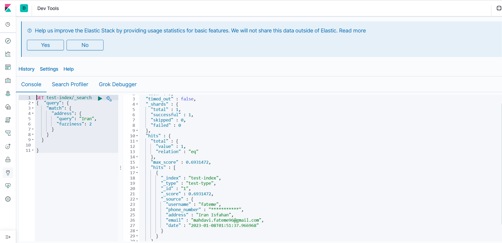

# Elasticsearch in Flask
Python | Flask | Elasticsearch | Kibana | Docker

## Usage

 - install docker-compose:
```
 pip install docker-compose
```
 - build and run your app:
```
 docker-compose up
```
## kibana interface
 - go to `http://localhost:5601`:




## APIs
- elasticsearch info and healthy:
```
[GET] http://localhost:5000/elastic/info
[GET] http://localhost:5000/elastic/health
```
- Add or update a doc:
```
[POST] http://localhost:5000/elastic/<user_id>
body:
{
    "username": "test",
    "phone_number":"000000000",
    "address":"test",
    "email": "test@test.com"
}
```
- Delete a doc:
```
[DELETE] http://localhost:5000/elastic/<user_id>
```

- Search a keyword in user address field:
```
[GET] http://localhost:5000/elastic/<Keyword>
```